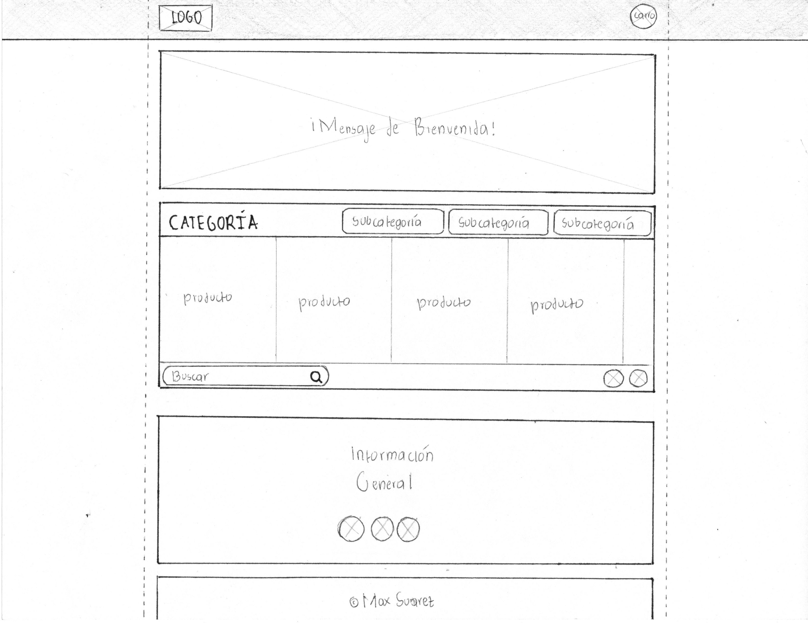
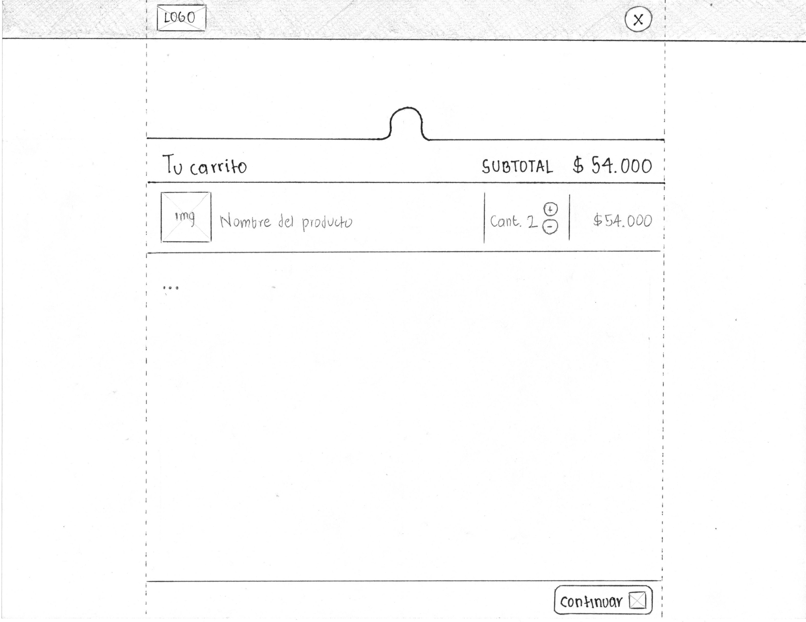
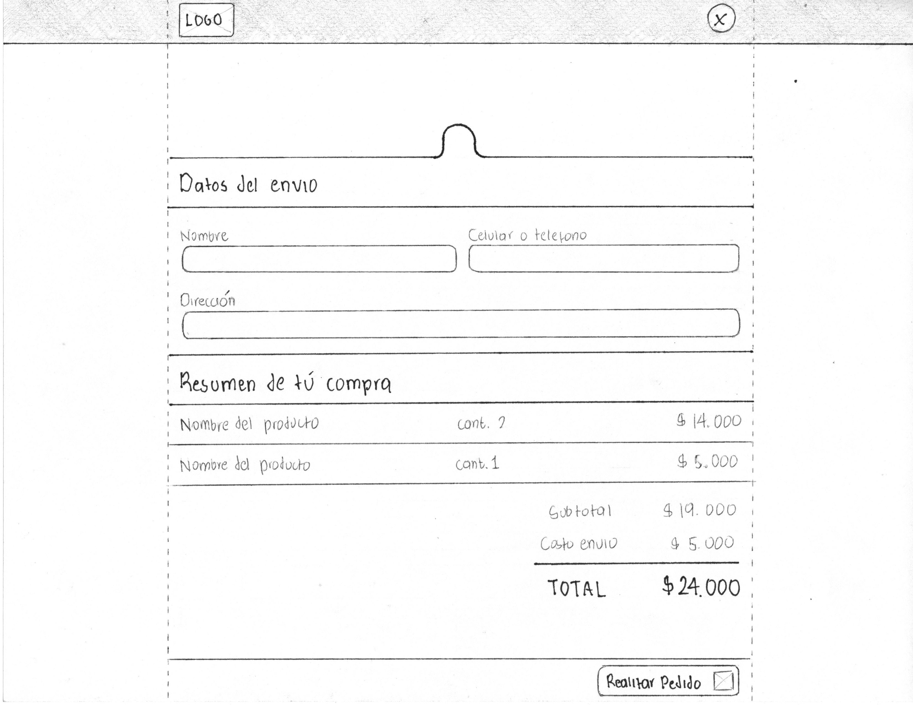
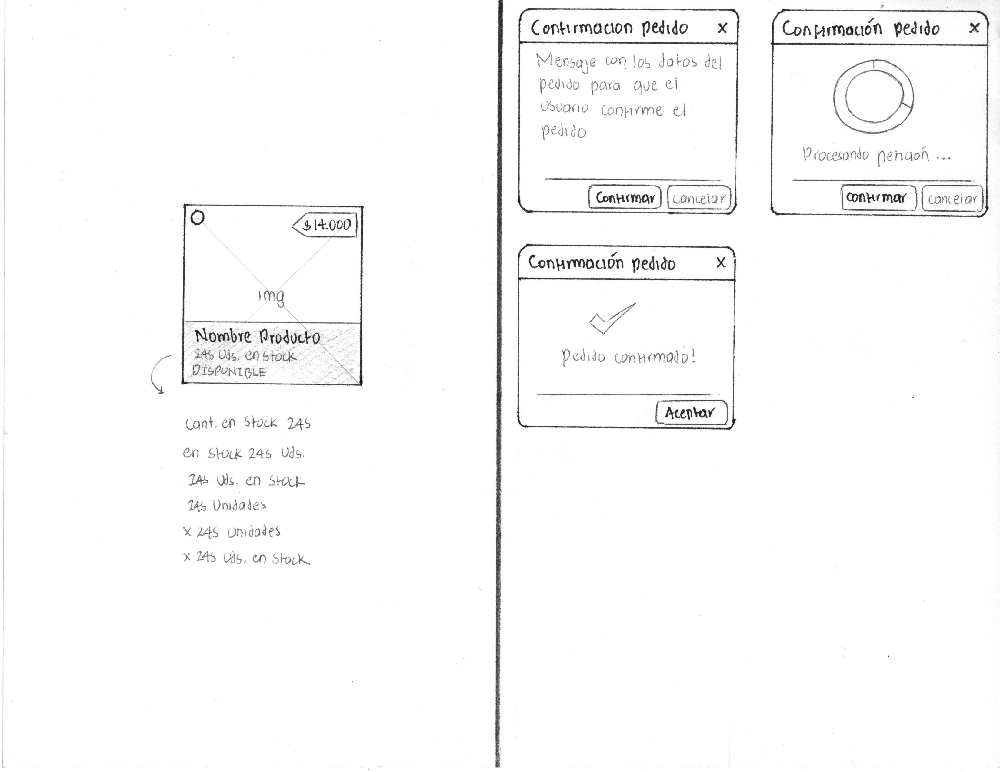

# El Baratón

App web de prueba para El Baratón! Tienda imaginaria creada para prueba tecnica de front-end.

[Live Demo](https://el-baraton-max.herokuapp.com/)

## Wireframes

Estos fuerón los wireframes base para la app:

## Implementación
Las interfaces se implementaron con `React`, `Reactstrap`, y clases css de `Bootsrap`.
